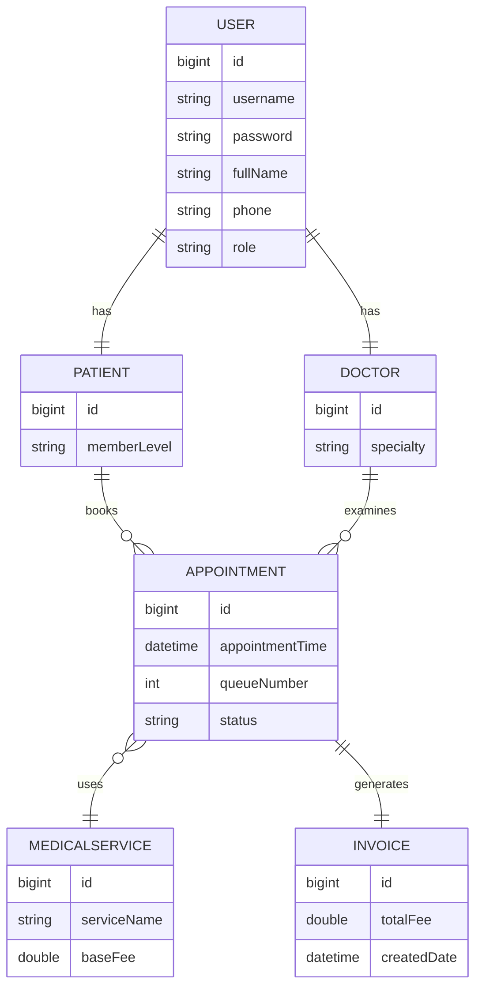

Bài 1:
1. Giải pháp công nghệ / Kiến trúc

Áp dụng SOLID (đặc biệt là Open/Closed Principle) kết hợp với Strategy Pattern và Dependency Injection.

InsuranceStrategy: xử lý tính phí theo từng loại bảo hiểm.
PaymentStrategy: xử lý từng cổng thanh toán.
NotificationService: xử lý gửi thông báo (SMS, Zalo ZNS,...).
ClinicBillingService chỉ gọi các interface, không chứa if-else cho từng loại bảo hiểm hay thanh toán.
2. Lịch sử Prompt
   Prompt 1

Hãy refactor ClinicBillingService để code sạch hơn và dễ đọc hơn.

Kết quả: AI chỉ tách hàm và đổi tên biến, vẫn giữ các câu lệnh if-else nên chưa đáp ứng yêu cầu mở rộng.

Prompt 2

Hãy refactor ClinicBillingService theo SOLID, áp dụng Strategy Pattern và Dependency Injection. Tách Insurance, Payment và Notification thành các interface độc lập để khi thêm loại bảo hiểm, cổng thanh toán hoặc hình thức thông báo mới thì không cần sửa ClinicBillingService.

Kết quả: AI tạo các interface và các class triển khai riêng, ClinicBillingService chỉ phụ thuộc vào abstraction.

3. Phân tích lỗi AI

Lỗi: Ở prompt đầu, AI chỉ cải thiện cách viết code nhưng vẫn giữ if-else, nên khi thêm bảo hiểm hoặc cổng thanh toán mới vẫn phải sửa ClinicBillingService.

Khắc phục: Bổ sung yêu cầu áp dụng Strategy Pattern, Dependency Injection và tuân thủ Open/Closed Principle để AI tách các chức năng thành các interface độc lập.

Bài 2:

1. Giải pháp công nghệ / Kiến trúc

Sử dụng Spring Security Exception Handling kết hợp với AuthenticationEntryPoint để xử lý tập trung các lỗi xác thực JWT.

JwtAuthenticationFilter: chỉ có nhiệm vụ đọc và xác thực token.
JwtAuthenticationEntryPoint: chịu trách nhiệm trả về JSON lỗi chuẩn.
SecurityConfig: cấu hình exceptionHandling().authenticationEntryPoint(...).

Nhờ đó, mọi lỗi token đều trả về cùng một định dạng JSON mà không cần xử lý ở từng Filter.

2. Lịch sử Prompt
   Prompt 1

Hãy sửa lỗi MalformedJwtException trong JwtAuthenticationFilter.

Kết quả: AI đề xuất bọc parseClaimsJws() bằng try-catch và trả về response.sendError(401).

Prompt 2

Hãy xử lý lỗi JWT theo kiến trúc Spring Security. Không dùng try-catch trong Filter mà xử lý tập trung bằng AuthenticationEntryPoint, trả về JSON thống nhất cho mọi lỗi token.

Kết quả: AI đề xuất tạo JwtAuthenticationEntryPoint, cấu hình trong SecurityConfig và để mọi lỗi xác thực được xử lý tập trung.

3. Phân tích lỗi AI

Lỗi: Ở prompt đầu, AI chỉ dùng try-catch trong JwtAuthenticationFilter. Cách này khiến logic xử lý lỗi nằm ngay trong Filter, dễ lặp lại và khó bảo trì khi có nhiều loại lỗi JWT.

Khắc phục: Yêu cầu AI sử dụng AuthenticationEntryPoint để tách riêng việc xử lý lỗi khỏi Filter, giúp toàn bộ lỗi xác thực trả về cùng một định dạng JSON và dễ mở rộng.

Bài 3:

Nhiệm vụ 1:

prompt yêu cầu AI:
Bạn là System Analyst. Hãy đề xuất Tech Stack phù hợp để xây dựng hệ thống quản lý phòng khám "Rikkei Care". Hệ thống có quản lý người dùng theo role, tính phí khám linh hoạt, theo dõi số thứ tự khám theo thời gian thực và yêu cầu khả năng mở rộng. Giải thích lý do lựa chọn từng công nghệ.

Tóm tắt giải pháp công nghệ

Thành phần	Công nghệ
Backend	    Spring Boot
Database	MySQL
ORM	Spring  Data JPA (Hibernate)
Security	Spring Security + JWT
Realtime	WebSocket
Build Tool	Maven
Frontend	ReactJS
Deployment	Docker

Lý do
Spring Boot dễ phát triển REST API.
Spring Security + JWT bảo mật theo Role.
WebSocket cập nhật số thứ tự khám theo thời gian thực.
MySQL phù hợp dữ liệu quan hệ.
Docker dễ triển khai.
Nhận xét

Đồng ý với đề xuất vì đáp ứng đầy đủ yêu cầu nghiệp vụ và có khả năng mở rộng trong tương lai.

Nhiệm vụ 2:
prompt yêu cầu AI:
Bạn là System Analyst.Hãy phân tích nghiệp vụ hệ thống Rikkei Care và xác định các Entity chính của cơ sở dữ liệu cùng các thuộc tính quan trọng.

Danh sách Entity
User:
id
username
password
fullName
phone
role

Patient:
id
memberLevel

Doctor:
id
specialty

Appointment:
id
appointmentTime
queueNumber
status

MedicalService:
id
serviceName
baseFee

Invoice:
id
totalFee
createdDate

Nhiệm vụ 3:
prompt yêu cầu AI:
Viết prompt yêu cầu AI tạo ra mã vẽ sơ đồ ERD (định dạng Mermaid hoặc PlantUML)
dựa trên các thực thể đã chốt.

Mã mermaid: 

